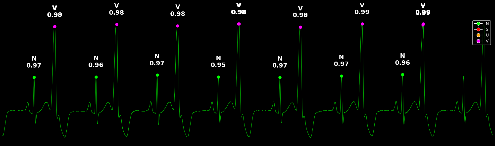

# ECG VectorDB Opensource Software

## Overview
Our ECG VectorDB is a specialized database system designed to efficiently process and analyze real-time ECG data. This system leverages vector embedding techniques and autoencoder-based beat classification to provide rapid and accurate ECG signal analysis.

## Example

## Features
- **Autoencoder-based ECG Beat Classifier**: Advanced neural network architecture for accurate beat classification and feature extraction
- **Real-time Vector Transformation**: Efficient conversion of ECG signals into vector space while preserving critical clinical information
- **Beat-level Classification DB**: Database system optimized for storing and retrieving beat-level classifier scores
- **Signal Compression**: Efficient data compression while maintaining clinical information integrity
